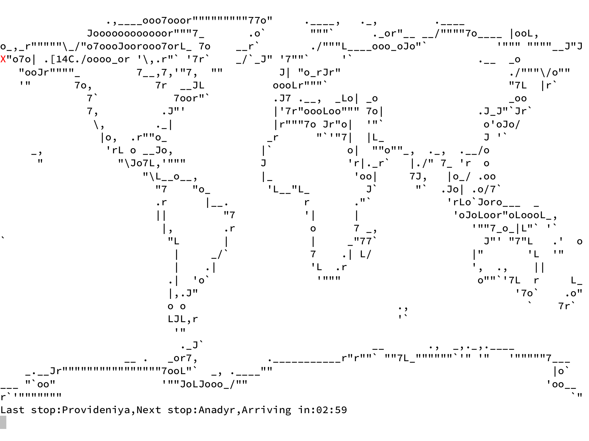

# strack
A C program that uses the Google Santa Tracker API to show Santa’s location.
## Requirements
libcurl, libgd, libshp. These are in the Ubuntu packages `libcurl4-openssl-dev`, `libgd-dev`, `libshp-dev` respectively. These are also in the Cygwin packages `libcurl-devel`, `libgd-devel`, and `libshp-devel`, respectively.
## Compilation
Run `make` to compile the default way.
## Usage
Simply `./strack` (or `strack.exe` on Windows). Use the command line parameter `autojson` to read the locations from a JSON file (named `example.json`).
## Screenshots

